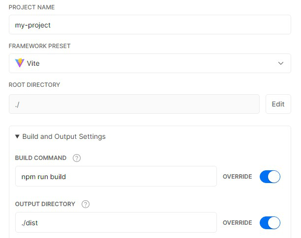
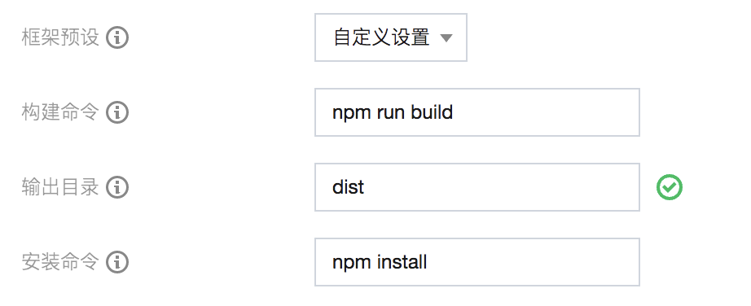

# 部署静态站点 {#deploying-a-static-site}

本指南建立在以下几个假设基础之上：

- 你正在使用的是默认的构建输出路径（`dist`）。这个路径 [可以通过 `build.outDir` 更改](/config/#build-outdir)，在这种情况下，你可以从这篇指南中找到出所需的指引。
- 你正在使用 NPM；或者 Yarn 等其他可以运行下面的脚本指令的包管理工具。
- Vite 已作为一个本地开发依赖（dev dependency）安装在你的项目中，并且你已经配置好了如下的 npm scripts：

```json
{
  "scripts": {
    "build": "vite build",
    "preview": "vite preview"
  }
}
```

值得注意的是 `vite preview` 用作预览本地构建，而不应直接作为生产服务器。

::: tip 注意
本篇指南提供了部署 Vite 静态站点的说明。Vite 也对服务端渲染（SSR）有了实验性的支持。SSR 是指支持在 Node 中运行相应应用的前端框架，预渲染成 HTML，最后在客户端激活（hydrate）。查看 [SSR 指南](./ssr) 了解更多细节。另一方面，如果你在寻找与传统服务端框架集成的方式，那么请查看 [后端集成](./backend-integration) 章节。
:::

## 构建应用 {#building-the-app}

你可以运行 `npm run build` 命令来执行应用的构建。

```bash
$ npm run build
```

默认情况下，构建会输出到 `dist` 文件夹中。你可以部署这个 `dist` 文件夹到任何你喜欢的平台。

### 本地测试应用 {#testing-the-app-locally}

当你构建完成应用后，你可以通过运行 `npm run preview` 命令，在本地测试该应用。

```bash
$ npm run build
$ npm run preview
```

`vite preview` 命令会在本地启动一个静态 Web 服务器，将 `dist` 文件夹运行在 http://localhost:5000。这样在本地环境下查看该构建产物是否正常可用就方便了。

你可以通过 `--port` 参数来配置服务的运行端口。

```json
{
  "scripts": {
    "preview": "vite preview --port 8080"
  }
}
```

现在 `preview` 命令会将服务器运行在 http://localhost:8080。

## GitHub Pages {#github-pages}

1. 在 `vite.config.js` 中设置正确的 `base`。

   如果你要部署在 `https://<USERNAME>.github.io/` 上，你可以省略 `base` 使其默认为 `'/'`。

   如果你要部署在 `https://<USERNAME>.github.io/<REPO>/` 上，例如你的仓库地址为 `https://github.com/<USERNAME>/<REPO>`，那么请设置 `base` 为 `'/<REPO>/'`。

2. 在你的项目中，创建一个 `deploy.sh` 脚本，包含以下内容（注意高亮的行，按需使用），运行脚本来部署站点：

   ```bash{13,20,23}
   #!/usr/bin/env sh

   # 发生错误时终止
   set -e

   # 构建
   npm run build

   # 进入构建文件夹
   cd dist

   # 如果你要部署到自定义域名
   # echo 'www.example.com' > CNAME

   git init
   git add -A
   git commit -m 'deploy'

   # 如果你要部署在 https://<USERNAME>.github.io
   # git push -f git@github.com:<USERNAME>/<USERNAME>.github.io.git main

<<<<<<< HEAD
   # 如果你要部署在 https://<USERNAME>.github.io/<REPO>
   # git push -f git@github.com:<USERNAME>/<REPO>.git master:gh-pages
=======
   # if you are deploying to https://<USERNAME>.github.io/<REPO>
   # git push -f git@github.com:<USERNAME>/<REPO>.git main:gh-pages
>>>>>>> 7ee013df1d23732b3f0f880c414c161ad21657f5

   cd -
   ```

::: tip
你也可以在你的 CI 中配置该脚本，使得在每次推送代码时自动部署。
:::

### GitHub Pages 配合 Travis CI {#github-pages-and-travis-ci}

1. 在 `vite.config.js` 中设置正确的 `base`。

   如果你要部署在 `https://<USERNAME or GROUP>.github.io/` 上，你可以省略 `base` 使其默认为 `'/'`。

   如果你要部署在 `https://<USERNAME or GROUP>.github.io/<REPO>/`，例如你的仓库地址为 `https://github.com/<USERNAME>/<REPO>`，那么请设置 `base` 为 `'/<REPO>/'`。

2. 在项目根目录创建一个 `.travis.yml` 文件

3. 在本地运行 `npm install` 并且提交（commit）生成的 lockfile (`package-lock.json`)。

4. 使用 GitHub Pages 部署的配置文件模板，并按照 [Travis CI 文档](https://docs.travis-ci.com/user/deployment/pages/) 进行配置：

   ```yaml
   language: node_js
   node_js:
     - lts/*
   install:
     - npm ci
   script:
     - npm run build
   deploy:
     provider: pages
     skip_cleanup: true
     local_dir: dist
     # 在 GitHub 上生成的 token，允许 Travis 推送代码到你的仓库。
     # 在仓库的 Travis 设置页面，设为安全的环境变量
     github_token: $GITHUB_TOKEN
     keep_history: true
     on:
       branch: main
   ```

## GitLab Pages 配合 GitLab CI {#gitlab-pages-and-gitlab-ci}

1. 在 `vite.config.js` 中设置正确的 `base`。

   如果你要部署在 `https://<USERNAME or GROUP>.gitlab.io/` 上，你可以省略 `base` 使其默认为 `'/'`。

   如果你要部署在 `https://<USERNAME or GROUP>.gitlab.io/<REPO>/` 上，例如你的仓库地址为 `https://gitlab.com/<USERNAME>/<REPO>`，那么请设置 `base` 为 `'/<REPO>/'`。

2. 在项目根目录创建一个 `.gitlab-ci.yml` 文件，并包含以下内容。它将使得每次你更改内容时都重新构建与部署站点：

   ```yaml
   image: node:16.5.0
   pages:
     stage: deploy
     cache:
       key:
         files:
           - package-lock.json
         prefix: npm
       paths:
         - node_modules/
     script:
       - npm install
       - npm run build
       - cp -a dist/. public/
     artifacts:
       paths:
         - public
     rules:
       - if: $CI_COMMIT_BRANCH == $CI_DEFAULT_BRANCH
   ```

## Netlify {#netlify}

1. 在 [Netlify](https://netlify.com) 上，使用以下设置，配置一个来自 GitHub 的项目：

   - **构建命令：** `vite build` 或 `npm run build`
   - **发布目录：** `dist`

2. 点击部署按钮。

## Google Firebase {#google-firebase}

1. 确保已经安装 [firebase-tools](https://www.npmjs.com/package/firebase-tools)。

2. 在项目根目录创建 `firebase.json` 和 `.firebaserc` 两个文件，包含以下内容：

   `firebase.json`:

   ```json
   {
     "hosting": {
       "public": "dist",
       "ignore": [],
       "rewrites": [
         {
           "source": "**",
           "destination": "/index.html"
         }
       ]
     }
   }
   ```

   `.firebaserc`:

   ```js
   {
     "projects": {
       "default": "<YOUR_FIREBASE_ID>"
     }
   }
   ```

3. 运行 `npm run build` 后，通过 `firebase deploy` 命令部署。

## Surge {#surge}

1. 首先确保已经安装 [surge](https://www.npmjs.com/package/surge)。

2. 运行 `npm run build`。

3. 运行 `surge dist` 命令部署到 surge。

你也可以通过添加 `surge dist yourdomain.com` 部署到一个 [自定义域名](http://surge.sh/help/adding-a-custom-domain)。

## Heroku {#heroku}

1. 安装 [Heroku CLI](https://devcenter.heroku.com/articles/heroku-cli)。

2. [注册](https://signup.heroku.com)一个 Heroku 账号。

3. 运行 `heroku login` 并填入你的 Heroku 凭证：

   ```bash
   $ heroku login
   ```

4. 在项目根目录创建一个 `static.json` ，包含以下内容：

   `static.json`:

   ```json
   {
     "root": "./dist"
   }
   ```

   这是你站点的配置，阅读 [heroku-buildpack-static](https://github.com/heroku/heroku-buildpack-static) 文档来了解更多。

5. 配置好你的 Heroku git 远程地址：

   ```bash
   # 版本变更
   $ git init
   $ git add .
   $ git commit -m "My site ready for deployment."

   # 创建一个具有指定名称的新应用
   $ heroku apps:create example

   # 为静态站点设置 buildpack
   $ heroku buildpacks:set https://github.com/heroku/heroku-buildpack-static.git
   ```

6. 部署站点：

   ```bash
<<<<<<< HEAD
   # 发布站点
   $ git push heroku master
=======
   # publish site
   $ git push heroku main
>>>>>>> 7ee013df1d23732b3f0f880c414c161ad21657f5

   # 在浏览器中打开 Heroku 的面板
   $ heroku open
   ```

## Vercel {#vercel}

要通过 [Vercel for Git](https://vercel.com/docs/git) 部署你的 Vite 应用，请确保它已被推送至一个 Git 仓库。

进入 https://vercel.com/import/git 并根据你的 Git 托管服务（GitHub, GitLab 或 BitBucket）将项目导入 Vercel。根据指引，选择带有 `package.json` 的项目根目录。并使用 `npm run build` 来覆写构建步骤，并将输出目录设置为 `./dist`。



在项目被导入之后，所有后续的推送都将生成预览部署，但只有对生产分支（通常是 “main”）所做的更改才会触发生产部署。

一旦部署，你会得到一个实时查看应用的 URL，如 https://vite.vercel.app。

## Azure 的静态网站应用 {#azure-static-web-apps}

你可以通过微软 Azure 的 [静态网站应用](https://aka.ms/staticwebapps) 服务来快速部署你的 Vite 应用。你只需：

- 注册 Azure 账号并获取一个订阅（subscription）的 key。可以在 [此处快速完成注册](https://azure.microsoft.com/free)。
- 将你的应用代码托管到 [GitHub](https://github.com)。
- 在 [VSCode](https://code.visualstudio.com) 中安装 [SWA 扩展](https://marketplace.visualstudio.com/items?itemName=ms-azuretools.vscode-azurestaticwebapps)。

安装完此扩展后，进入你应用的根目录。打开 SWA 的扩展程序，登录 Azure，并点击 '+'，来创建一个全新的 SWA。系统会提示你指定所需的订阅 key。

按照扩展程序的启动向导，给你的应用程序起个名字，选择框架预设，并指定应用程序的根目录（通常为 `/`）以及构建文件的路径 `/dist`。此向导完成后，会在你的 repo 中的 `.github` 文件夹中创建一个 Github Action。

这个 action 致力于部署你的应用程序（可以在仓库的 Actions 标签中，查看相关进度），成功完成后，你可以点击 Github 中出现的 “浏览站点” 的按钮，查看你的应用程序。

## 腾讯云 Webify

[腾讯云 Webify](https://webify.cloudbase.net/) 支持从 Git 仓库直接部署您的 Vite 应用。

进入 [Webify 新建应用页面](https://console.cloud.tencent.com/webify/new)，根据选择您代码仓库所在的 Git 平台（GitHub、GitLab 或者 Gitee 码云），完成授权流程后，便可导入仓库。

应用配置如下：

- 构建命令填入 `npm run build`
- 输出目录填入 `dist`，
- 安装命令填入 `npm install`



应用创建之后，等待构建、部署完毕，便可以通过应用的默认域名（`.app.tcloudbase.com`）来访问应用。如 https://my-vite-vue-app-4gi9tn1478d8ee71-1255679239.ap-shanghai.app.tcloudbase.com/
